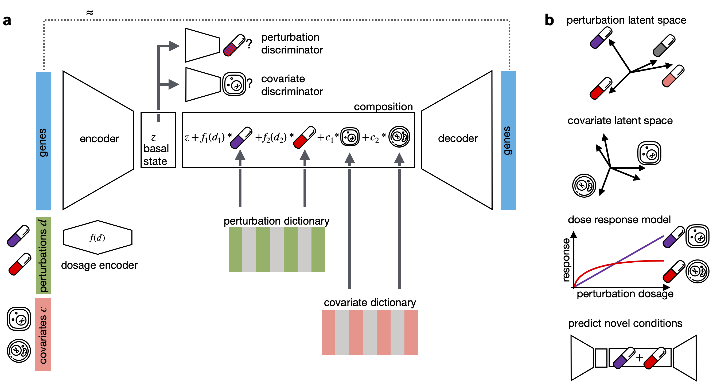

# CPA - Compositional Perturbation Autoencoder

`CPA` is a collaborative research project from
Facebook AI Research (FAIR) and a computatiobal biology group of Prof. Fabian 
Theis (https://github.com/theislab) from Helmholtz Zentrum München. 

## What is CPA?


`CPA` is a framework to learn effects of perturbations at the single-cell level. CPA encodes and learns phenotypic drug response across different cell types, doses and drug combinations. CPA allows:

* Out-of-distribution predicitons of unseen drug combinations at various doses and among different cell types.
* Learn interpretable drug and cell type latent spaces.
* Estimate dose response curve for each perturbation and their combinations.
* Access the uncertainty of the estimations of the model.

## Package Structure

The repository is centered around the `compert` module:

* [`compert.train`](compert/train.py) contains scripts to train the model.
* [`compert.api`](compert/api.py) contains user friendly scripts to interact with the model via scanpy.
* [`compert.plotting`](compert/plotting.py) contains scripts to plotting functions.
* [`compert.model`](compert/model.py) contains modules of compert model.
* [`compert.data`](compert/data.py) contains data loader, which transforms anndata structure to a class compatible with compert model.
* [`compert.collect_results`](compert/collect_results.py) contains script for automatic model selection from sweeps.

Additional files and folders:

* [`datasets`](datasets/) contains both versions of the data: raw and pre-processed.
* [`preprocessing`](preprocessing/) contains notebooks to reproduce the datasets pre-processing from raw data.
* [`notebooks`](notebooks/) contains notebooks to reproduce plots from the paper and detailed analysis of each of the datasets.
* [`pretrained_models`](pretrained_models/) contains best models selected after the sweeps. These models were used for the analysis and figures in the paper.
* [`scripts`](scripts/) contains bash files for automatic running of the model.

## Usage

To learn how to use this repository, check 
[`./notebooks/demo.ipynb`](notebooks/demo.ipynb), and the following scripts:

* [`./scripts/run_one_epoch.sh`](scripts/run_one_epoch.sh) runs one epoch for all datasets.
* [`./scripts/run_sweeps.sh`](scripts/run_sweeps.sh) runs all sweeps.
* [`./scripts/run_collect_results.sh`](scripts/run_collect_results.sh), given a sweep, runs model-selection and prints results.

* Note that hyperparameters in the `demo.ipynb` are not default and will not work work for new datasets. Please make
sure to run `run_sweeps.sh` for your new dataset to find best hyperparameters.

## Examples and Reproducibility
All the examples and the reproducbility notebooks for the plots in the paper could be found in the [`notebooks/`](notebooks/) folder.

## Training a model

There are two ways to train a compert model:

* Using the command line, e.g.: `python -m compert.train --dataset_path datasets/GSM_new.h5ad  --save_dir /tmp --max_epochs 1 --doser_type sigm`
* From jupyter notebook: example in [`./notebooks/demo.ipynb`](notebooks/demo.ipynb)

## Testing

Run `python ./scripts/run_one_epoch.sh` to perfrom automatic testing for one epoch of all the datasets used in the study.


## Documentation

Currently you can access the documentation via `help` function in IPython. For example:

```python
from compert.api import ComPertAPI

help(ComPertAPI)

from compert.plotting import CompertVisuals

help(CompertVisuals)

```

A separate page with the documentation is coming soon.

## Support and contribute

If you have a question or noticed a problem, you can post an [`issue`](https://github.com/facebookresearch/CPA/issues/new).

## Reference

Please cite the following preprint if you find CPA useful in your research.
```
@article {Lotfollahi2021.04.14.439903,
	author = {Lotfollahi, Mohammad and Susmelj, Anna Klimovskaia and De Donno, Carlo and Ji, Yuge and Ibarra, Ignacio L. and Wolf, F. Alexander and Yakubova, Nafissa and Theis, Fabian J. and Lopez-Paz, David},
	title = {Learning interpretable cellular responses to complex perturbations in high-throughput screens},
	elocation-id = {2021.04.14.439903},
	year = {2021},
	doi = {10.1101/2021.04.14.439903},
	publisher = {Cold Spring Harbor Laboratory},

	URL = {https://www.biorxiv.org/content/early/2021/05/18/2021.04.14.439903},
	eprint = {https://www.biorxiv.org/content/early/2021/05/18/2021.04.14.439903.full.pdf},
	journal = {bioRxiv}
}
```

The preprint titled **Learning interpretable cellular responses to complex perturbations in high-throughput screens** can be found [here](https://www.biorxiv.org/content/10.1101/2021.04.14.439903v2).
## License

This source code is released under the MIT license, included [here](LICENSE).
